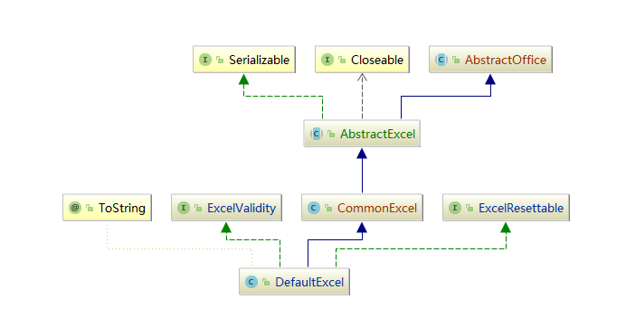
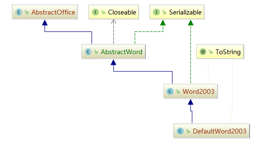
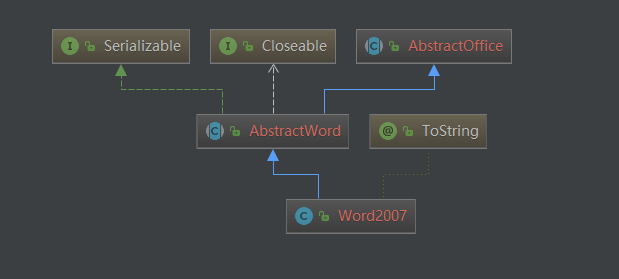

# 使用说明

Java针对MS Office的操作的库屈指可数，比较有名的就是Apache的POI库。一些有名的开源工具如：**hutool**，也对POI进行了二次封装。我基于自己做项目时的一些需求，针对POI进行了二次封装，并进行了一系列改进，使Java操作Excel、Word等文件变得更加简单。本框架相比于**hutool**等更“轻”，没有十分复杂的设计模式、接口等，上手更加容易。

[toc]

## 环境&依赖

* jdk1.8
* poi3.17

idea中直接导入maven项目即可完成初始构建。

## 表格处理

源码实现主要在*com.jzy.office.excel*下

### Demo示例

在*com.jzy.demo.excel*包下有一些示例程序。

* SimpleReadExcelDemo：一个简单的读excel示例。修改相应的输入文件路径信息后即可运行，下同...

  ```java
  public class SimpleReadExcelDemo {
      public static void main(String[] args) throws IOException, InvalidFileTypeException {
          //改成你实际的文件路径
          String filePath = "E:\\Engineering\\java\\idea\\excel-processing\\example\\test1.xlsx";
          //通过文件绝对路径构造excel对象
          DefaultExcel excel = new DefaultExcel(filePath);
  		...
      }
  }
  ```

* SimpleWriteExcelDemo：一个简单的写excel示例。

* ReadSeatTableDemo：读取座位表信息示例。

* WriteSeatTableDemo：修改座位表信息示例。给定一个教室，一组学生姓名列表，要求在座位表模板的基础上只输出该教室的sheet并将列表中的学生按座位顺序依次填充。

  .....

### DefaultExcel——默认的excel处理类



`DefaultExcel`是处理excel默认类，支持解析.xlsx、.xls、.et文件于一体，直接使用`DefaultExcel`或者继承`DefaultExcel`都可以方便的读写excel。它又继承自类`CommonExcel`，该类是核心，继承自抽象类`AbstractExcel`，实现了大量对poi处理excel二次封装后的方法；`ExcelValidity`接口用于检验表格的合法性；`Resettable`接口用于体现表格各类参数可重置的特性。

#### 构造DefaultExcel对象

要处理excel前我们首先要根据输入excel文件构造处理对象。一个最基础的方法就是使用`DefaultExcel`类。

- 简单地，你可以直接由文件绝对路径构造DefaultExcel对象。

  ```java
  String filePath="E:\\test1.xlsx";
  //通过文件绝对路径构造excel对象
  DefaultExcel excel=new DefaultExcel(filePath);
  ```

- 你也可以传入InputStream流对象，并指定excel的版本以构造DefaultExcel对象。

  ```java
  String filePath="E:\\\test1.xlsx";
  //通过InputStream流对象，并指定excel的版本构造excel对象
  DefaultExcel excel=new DefaultExcel(new FileInputStream(new File(filePath)), ExcelVersionEnum.VERSION_2007);
  ```

- 当然，如果你仅仅想创建一个新的excel，而不是读取已有的文件，你可以直接如下构造：

  ```java
  //创建一个新的excel2007文件
  DefaultExcel excel2007 =new DefaultExcel(ExcelVersionEnum.VERSION_2007);
  //创建一个新的excel2003文件
  DefaultExcel excel2003 =new DefaultExcel(ExcelVersionEnum.VERSION_2003);
  ```

  构造excel表格的版本通过枚举`ExcelVersionEnum`决定。

#### 进行读操作

完成excel对象的构造后，就可以直接调用其已实现的方法来读取表格信息。

* 获取当前表格的sheet数量

  ```java
  int sheetCount = excel.getSheetCount();
  ```

* 获取第n张sheet的总行数，通过传入sheet索引数值n-1，下同。如第一张sheet索引值为0，类比数组。

  ```java
  int sheetIndex=0; // 第一张sheet
  int rowCount = excel.getRowCount(sheetIndex);
  ```

* 获取指定sheet的名称。

  ```java
  String sheetName = excel.getSheetName(sheetIndex);
  ```

* 根据sheet名称获取该名称对应sheet的索引。

  ```java
  int targetSheetIndex = excel.getSheetIndex(sheetName);
  ```

* 获取指定sheet指定行的所有值。

  ```java
  int rowIndex = 0; //第1行
  List<String> rowValue = excel.readRow(sheetIndex, rowIndex);
  ```

* 获取指定sheet指定列的所有值（从指定行开始到最后）

  ```java
  int columnIndex = 0; //第1列
  int startRow = 1; //第2行开始
  List<String> columnValue = excel.readColumn(sheetIndex, startRow, columnIndex);
  ```

* 获取指定sheet指定行指定列的单元格中的内容。

  ```java
  String cellValue = excel.read(sheetIndex, rowIndex, columnIndex);
  ```

* 获取指定sheet从指定行开始到指定行结束所有行的内容

  ```java
  int endRow = 3;
  List<List<String>> rowValues = excel.readRows(sheetIndex, startRow, endRow);
  ```

* 获取指定sheet的全部内容

  ```java
  List<List<String>> allData = excel.read(sheetIndex);
  ```

更多方法请参见`AbstractExcel`类及其实现子类`CommonExcel`。

#### 进行写操作

* 清除第指定sheet中所有内容。

  ```java
  int sheetIndex=0;
  excel.clearSheet(sheetIndex);
  ```

* 往指定sheet的指定行批量写入数据

  ```java
  int rowIndex = 0;
  excel.writeRow(sheetIndex, rowIndex, Arrays.asList("我是", "第一行", "新的数据"));
  ```

* 往指定sheet的指定列批量写入数据

  ```java
  int columnIndex=0;
  excel.writeColumn(sheetIndex, columnIndex, Arrays.asList("我是", "第一列", "新的数据"));
  ```

* 往指定sheet的指定行和指定列的单元格写入数据

  ```java
  int targetRow = 1; //第2行
  int targetColumn = 1; //第2列
  excel.write(sheetIndex,targetRow, targetColumn, "你好");
  ```

* 往指定sheet的指定范围内的单元格写入同一个数据

  ```java
  int startRow = 3; //第4行开始
  int endRow=5; //第6行结束
  int startColumn = 0; //第1列开始
  int endColumn=3; //第4列结束
  excel.write(sheetIndex, startColumn, endColumn, startRow, endRow, "重复值");
  ```

* 删除指定sheet的指定行

  ```java
  int rowToRemove=5;
  excel.removeRow(sheetIndex, rowToRemove);
  ```

* 删除指定sheet的多行

  ```java
  int rowToRemoveStart=3;
  int rowToRemoveEnd=4;
  //删除第4~5行
  excel.removeRows(sheetIndex, rowToRemoveStart, rowToRemoveEnd);
  ```

* 保存修改后的文件。

  ```java
  //修改后另存为文件路径
  String savePath="C:\\Users\\92970\\Desktop\\1.xlsx";
  //excel.saveAndClose();//这样会直接覆盖更新原文件
  excel.saveAndClose(savePath);
  ```

更多方法请参见`AbstractExcel`类及其实现子类`CommonExcel`。

### AbstractInputExcel——要读取的目标表格抽象类

​	在实际的业务情景中，读取表格可能涉及更多更复杂的操作，如预先进行各种合法性校验等，而继承`AbstractInputExcel`抽象类并实现或重写其相应方法是一个不错的选择。`AbstractInputExcel`抽象类继承自`DefaultExcel`并实现了`ExcelReadable`接口，采用“模板模式”的设计模式。

​	故可以将对某一目标表格的某一种读取模式写在一个类中，而该类继承`AbstractInputExcel`类，实现其相应方法，然后调用抽象父类的`testAndReadData`方法即可以“模块化”地实现一次复杂的校验和读取。***com.jzy.demo.excel.input*包中的`Test1InputExcel`就是一个很好的示例。**

子类可以重写的方法如下：

```java
  	/**
     * 非必须。重置所有暂存的读取结果（成员变量）
     */
    @Override
    public void resetOutput() {

    }

    /**
     * 非必须。重置带读取的目标列索引值
     */
    @Override
    public void resetColumnIndex() {

    }

    /**
     * 非必须。找到要读取的列的位置索引值
     *
     * @param sheetIx 要处理的sheet的索引
     */
    @Override
    protected void findColumnIndexOfSpecifiedName(int sheetIx) {

    }

    /**
     * 非必须。测试判断要读取的目标列是否找到（子类实现）。如果没有，抛出异常。
     *
     * @return
     * @throws ExcelColumnNotFoundException 规定名称的列未找到
     */
    @Override
    public boolean testColumnNameValidity() throws ExcelColumnNotFoundException {

        return false;
    }

    /**
     * 核心方法，具体的读取数据操作。将数据存储于类成员变量中。
     * 
     * @param sheetIndex sheet索引
     * @return 当前sheet的有效行数
     */
    @Override
    public int readData(int sheetIndex) {
        
        return 0;
    }
```

**通过调用抽象父类的模板方法`testAndReadData`可以完成一次完整的校验和读取**，而上述方法在抽象父类的模板方法的执行顺序是：

1. resetOutput
2. resetColumnIndex
3. findColumnIndexOfSpecifiedName
4. testColumnNameValidity
5. readData

### AbstractTemplateExcel——模板表格抽象类

​	`AbstractTemplateExcel`是待输出的模板表格的抽象类。所谓模板类型的表格，即通常不用读取数据，只需根据当前模板做一定修改然后给用户保存。因此也不用对列名进行匹配检测等。`AbstractInputExcel`抽象类继承自`DefaultExcel`并实现了`ExcelWriteable`接口。你只需自定义一个类继承`AbstractInputExcel`抽象类，实现`writeData`方法然后调用`writeData`方法即可完成写入。

***com.jzy.demo.excel.template*包中的`Test1TemplateExcel`就是一个很好的示例。**

```java
    /**
     * 将预先存放好的数据执行写入到当前excel中。
     *
     * @return
     */
    @Override
    public boolean writeData() {
        return true;
    }
```

### 构造既可读又可写的表格类

有时我们读取输入表格的同时还需要对该表格修改，返回给用户，即又读又写。这种情况，优雅地，你可继承`AbstractInputExcel`的同时实现`ExcelWriteable`接口。

***com.jzy.demo*包中的`ReadableAndWriteableTest1Excel`就是一个很好的示例。**

```java
public class ReadableAndWriteableTest1Excel extends AbstractInputExcel implements ExcelWriteable {
    @Override
    public void resetOutput() {

    }

    @Override
    public void resetColumnIndex() {

    }

    @Override
    protected void findColumnIndexOfSpecifiedName(int sheetIx) {
      
    }

    @Override
    public boolean testColumnNameValidity() throws ExcelColumnNotFoundException {
        return true;
    }

    @Override
    public int readData(int sheetIndex) {
        return 0;
    }

    @Override
    public boolean writeData() {
        return true;
    }

}

```


## 文档处理

源码实现主要在*com.jzy.office.word*下

### Demo示例

在*com.jzy.demo.word*包下有一些示例程序。

* SimpleReadExcelDemo：一个简单的读excel示例。修改相应的输入文件路径信息后即可运行，下同...

  ```java
  public class SimpleReadExcelDemo {
      public static void main(String[] args) throws IOException, InvalidFileTypeException {
          //改成你实际的文件路径
          String filePath = "E:\\Engineering\\java\\idea\\excel-processing\\example\\test1.xlsx";
          //通过文件绝对路径构造excel对象
          DefaultExcel excel = new DefaultExcel(filePath);
  		...
      }
  }
  ```

* SimpleWriteExcelDemo：一个简单的写excel示例。

* ReadSeatTableDemo：读取座位表信息示例。

* WriteSeatTableDemo：修改座位表信息示例。给定一个教室，一组学生姓名列表，要求在座位表模板的基础上只输出该教室的sheet并将列表中的学生按座位顺序依次填充。

  .....

### DefaultWord2003——默认的word 2003文档处理类



`DefaultWord2003`是处理word 2003文档默认类，支持解析.doc、.wps文件，直接使用`DefaultWord2003`或者继承`DefaultWord2003`都可以方便的读写word。它又继承自类`Word2003`，该类继承自抽象类`AbstractWord`，针对poi对word 2003的接口进行了个性化的二次封装。

#### 构造DefaultWord2003对象

word对象的构建方法与excel异曲同工。

- 简单地，你可以直接由文件绝对路径构造DefaultWord2003对象。

  ```java
  String filePath = "E:\\Engineering\\java\\idea\\easy-office-process\\example\\1.doc";
  //构造word 2003对象
  DefaultWord2003 word2003 = new DefaultWord2003(filePath);
  ```

- 你也可以传入InputStream流对象，并指定excel的版本以构造DefaultExcel对象。

  ```java
  String filePath = "E:\\Engineering\\java\\idea\\easy-office-process\\example\\1.doc";
  //通过InputStream流对象，并指定word的版本构造word对象
  DefaultWord2003 excel=new DefaultWord2003(new FileInputStream(new File(filePath)), WordVersionEnum.VERSION_2003);
  ```


#### 进行读操作

完成word对象的构造后，就可以直接调用其已实现的方法来读取文档信息。

* 获取当前文档的段落数量（包含表格中的段落）

  ```java
  int paraNum = word2003.getParagraphNum();
  ```

* 获取当前文档的表格数量

  ```java
  int tableNum = word2003.getTableNum();
  ```
  
* 获取所有段落的文本，依次存于list中

  注意由于结构以及poi提供接口的不同：对word 2003子类实现对于段落的解析时，会把表格对象的段落也作为文档段落一并读出

  ```java
  List<String> paraStrings = word2003.readParagraphsToList();
  ```

* 获取特定段落的文本

  ```java
  //获取第paraPos+1段的文本
  int paraPos = 2;
  String para2Text = word2003.readParagraph(paraPos);
  ```

* 获取指定表格的所有值。

  ```java
  //读取第tablePos+1个表格的内容
  int tablePos = 0;
  List<List<List<String>>> table1 = word2003.readTable(tablePos);
  ```

  这里的com.jzy.office.word.AbstractWord#readTable(int)方法**返回的是当前文档对应表格的二维数据list，二维数组每个元素都是对应单元格的一个list，因为每个单元都可以认为是多个“段落”的结合，因此该list是这些段落的集合。下同理**

  ```java
  /**
   * 返回第pos+1个表格的文本。
   * 按表格二维结构，返回对应结构的二维数组。每个二维数组元素都是对应单元格段落的list
   * -------------------------------------------------------------
   * |   List<String>    |   List<String>    |   List<String>    |
   * -------------------------------------------------------------
   * |   List<String>    |   List<String>    |   List<String>    |
   * -------------------------------------------------------------
   * ...
   *
   * @param pos 表格索引
   * @return 表格二维数组
   */
  public List<List<List<String>>> readTable(int pos) {
      checkTableRange(pos);
      return readTable0(pos);
  }
  ```

* 获取指定表格指定列的所有值。

  ```java
  //读取第1个表格第1列的文本
  int tablePos = 0;
  int columnPos = 0;
  List<List<String>> columnStrings = word2003.readTableColumn(tablePos, columnPos);
  ```

* 获取指定表格指定行的所有值。

  ```java
  //读取第1个表格第1行的文本
  int tablePos = 0;
  int rowPos = 0;
  List<List<String>> rowStrings = word2003.readTableRow(tablePos, rowPos);
  ```

* 获取指定表格指定行指定列的值。

  ```java
  //读取第1个表格第2行第3列的文本
  int tablePos = 0;
  int rowPos = 1;
  int columnPos = 2;
  List<String> cellStrings = word2003.readTable(tablePos, rowPos, columnPos);
  ```

更多方法请参见`AbstractWord`类及其实现子类`Word2003`。

#### 进行写操作

* 目前提供的接口主要支持替换文本的写操作。通过传入给定的HashMap作为替换书签集，以下方法为例，replaceInPara方法会遍历书签集，并在第3段文本中寻找是否包含了书签集的某个键，如果包含，替换为对应的值；并返回所有成功被替换的

  ```java
  //创建准备替换的书签集
  HashMap<String, String> bookmark = new HashMap<>();
  bookmark.put("${table}", "0000");
  bookmark.put("${label1}", "1111");
  
  //使用bookmark替换第3段中内容
  int paraPos = 2;
  HashMap<String, String> replacedBookmark = word2003.replaceInPara(paraPos, bookmark);
  ```

* 对全文所有段落使用指定书签集进行替换。

  ```java
  //这样对全文所有段落进行替换
  HashMap<String, String> replacedBookmark2 = word2003.replaceInParas(bookmark);
  ```

* 对指定的表格使用指定书签集进行替换。

  ```java
  //使用bookmark替换第1个表格中内容
  int tablePos = 0;
  HashMap<String, String> replacedBookmark3 = word2003.replaceInTable(tablePos, bookmark);
  ```

* 对全文所有表格使用指定书签集进行替换。

  ```java
  //这样对全文所有表格进行替换
  HashMap<String, String> replacedBookmark4 = word2003.replaceInTables(bookmark);
  ```
  
* 对全文所有段落和表格使用指定书签集进行替换。注意由于word 2003子类实现对于段落的解析时，会把表格对象的段落也作为文档段落，因此使用该方法的效果和`word2003.replaceInParas(bookmark)`是一样的。

  ```java
  //这样对全文所有段落和表格进行替换
  HashMap<String, String> replacedBookmark5 =word2003.replaceInAll(bookmark);
  ```
  
* 删除指定sheet的指定行

  ```java
  int rowToRemove=5;
  excel.removeRow(sheetIndex, rowToRemove);
  ```

* 删除指定sheet的多行

  ```java
  int rowToRemoveStart=3;
  int rowToRemoveEnd=4;
  //删除第4~5行
  excel.removeRows(sheetIndex, rowToRemoveStart, rowToRemoveEnd);
  ```

* 保存修改后的文件。

  ```java
  String savePath = "C:\\Users\\92970\\Desktop\\1.doc";
  //word2003.saveAndClose();//这样会直接覆盖更新原文件
  word2003.saveAndClose(savePath);
  ```

更多方法请参见`AbstractWord`类及其实现子类`Word2003`。

### DefaultWord2007——默认的word 2007文档处理类



`DefaultWord2007`与`DefaultWord2003`完全类似，是处理word 2007文档默认类，支持解析.docx文件。下面仅展示部分区别如下，其余使用类比参考2003：

#### 构造DefaultWord2007对象

除了类名不同，构造原理都相同。

- 直接由文件绝对路径构造。

  ```java
  String filePath = "E:\\Engineering\\java\\idea\\easy-office-process\\example\\1.docx";
  //构造word 2007对象
  DefaultWord2007 word2007 = new DefaultWord2007(filePath);
  ```

- 传入InputStream流对象，并指定word的版本以构造。

  ```java
  String filePath = "E:\\Engineering\\java\\idea\\easy-office-process\\example\\1.docx";
  //通过InputStream流对象，并指定word的版本构造word对象
  DefaultWord2007 excel=new DefaultWord2007(new FileInputStream(new File(filePath)), WordVersionEnum.VERSION_2007);
  ```

#### 进行读操作

在Word2007子类实现中，对段落读取时，与2003有所区别：他不会把表格对象的段落作为文档段落。

典型的如：

```java
public abstract int getParagraphNum();

public abstract List<String> readParagraphsToList();
```

其他方法均与Word2003类似。

更多方法请参见`AbstractWord`类及其实现子类`Word2007`。

#### 进行写操作

* 需要区别于2003的是对于段落的替换，注意由于word 2003子类实现对于段落的解析时，会把表格对象的段落也作为文档段落；而2007，会区分表格和段落。因此仅需替换段落请使用`word2003.replaceInParas(bookmark)`，需要同时替换所有段落和表格请使用`word2003.replaceInAll(bookmark)`。

* 另一方面，在替换操作上，Word2007子类引入了更高级的“标签匹配器”，可以更自由和优雅的对段落或表格进行替换操作。详细源码见

  *com.jzy.office.matcher*包。下面仅介绍应用：

  之前我们传入书签时，手动给定了${}的标识结构

  ```java
  bookmark.put("${table}", "0000");
  bookmark.put("${label1}", "1111");
  ```

  而标签匹配器的作用正是基于正则表达式的封装实现自定义标签的格式，更自由且优雅。

  * 下面的代码使用的默认标签匹配器LabelMatchers.DEFAULT_LABEL_MATCHER进行替换，该匹配器使用的正则表达式为："\\$\\{(.+?)\\}"

    它对输入的书签集中的标签，在段落文本中寻找${key}的标签。如table，它就会在指定段落中找到所有${table}，并将其替换为对应值。注意对于段落中那些在bookmark没有找到的${key}，方法会将其替换为空值。

    ```java
    //创建准备替换的书签集
    HashMap<String, String> bookmark = new HashMap<>();
    bookmark.put("table", "0000");
    bookmark.put("label1", "1111");
    
    //使用bookmark使用默认标签匹配器替换第4段中内容
    int paraPos = 3;
    HashMap<String, String> replacedBookmark = word2007.replaceInParaUsingLabelMatcher(paraPos, bookmark, LabelMatchers.DEFAULT_LABEL_MATCHER);
    ```

  * 使用自定义标签匹配器，这里传入正则表达式"\\{\\{(.+?)\\}\\}"创建一个匹配器，该匹配器会解析所有{{key}}的标签。

    ```java
    //使用bookmark使用自定义标签匹配器替换第2段中内容
    int paraPos2 = 2;
    //使用匹配{{key}}的标签匹配器
    LabelMatcher lMatcher = LabelMatchers.getLabelMatcher("\\{\\{(.+?)\\}\\}");
    HashMap<String, String> replacedBookmark2 = word2007.replaceInParaUsingLabelMatcher(paraPos2, bookmark, lMatcher);
    ```

  表格的替换类似。

更多方法请参见`AbstractWord`类及其实现子类`Word2007`。